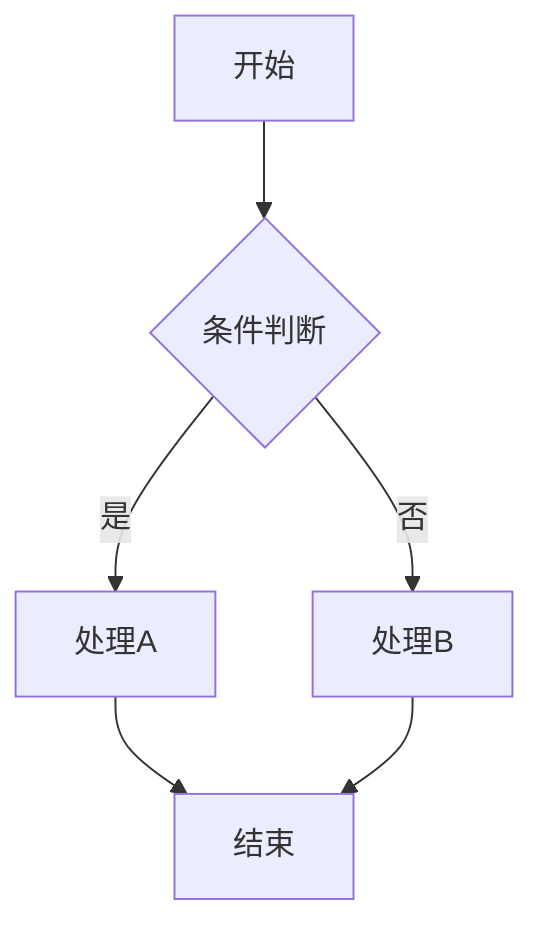

# 增强版 Mermaid 交互式渲染器

一个基于 AntV G6 的高级 Mermaid 图表渲染工具，支持节点点击高亮连线的交互功能。

## 🚀 核心功能

### 交互式可视化
- **节点点击高亮**: 点击任意节点可高亮显示与该节点相关的所有连线
- **连线高亮**: 相关连线会以红色高亮显示，并带有阴影效果
- **连接节点高亮**: 与选中节点相连的其他节点也会被高亮
- **画布点击清除**: 点击空白区域可清除所有高亮状态

### 多图表类型支持
- **流程图** (Flowchart/Graph): 支持各种节点形状和连接方式
- **时序图** (Sequence Diagram): 支持参与者和消息交互
- **甘特图** (Gantt Chart): 支持任务状态和时间线
- **类图** (Class Diagram): 支持类关系和继承
- **状态图** (State Diagram): 支持状态转换

### 高级渲染功能
- **高质量图片导出**: 支持复制到剪贴板和下载PNG图片
- **响应式布局**: 自动适应不同屏幕尺寸
- **拖拽交互**: 支持拖拽画布、缩放、移动节点
- **网格背景**: 提供网格背景便于对齐

## 🎨 技术特性

### 基于 AntV G6
- 使用 AntV G6 4.8.24 版本作为可视化引擎
- 支持丰富的交互模式和自定义样式
- 高性能的图形渲染和动画效果

### 智能解析器
- 自研 Mermaid 语法解析器
- 支持多种图表类型的语法解析
- 自动识别节点类型和连接关系
- 智能布局算法 (Dagre)

### 现代化界面
- 响应式设计，支持桌面和移动设备
- 渐变背景和现代化UI组件
- 实时状态提示和错误处理
- 快捷键支持 (Ctrl+Enter 渲染, Ctrl+S 复制)

## 📋 使用方法

### 1. 基本使用
1. 在左侧编辑器中输入 Mermaid 代码
2. 点击"🔄 渲染图表"按钮
3. 在右侧预览区域查看渲染结果
4. 点击任意节点体验高亮功能

### 2. 快速示例
点击示例按钮快速加载预设图表：
- **流程图**: 基本的决策流程
- **时序图**: 用户交互时序
- **甘特图**: 项目时间线
- **类图**: 面向对象关系
- **状态图**: 状态转换
- **复杂流程图**: 多分支复杂流程

### 3. 交互操作
- **点击节点**: 高亮相关连线和节点
- **拖拽画布**: 移动视图
- **滚轮缩放**: 放大缩小图表
- **拖拽节点**: 调整节点位置
- **点击空白**: 清除高亮状态

### 4. 导出功能
- **复制图片**: 将图表复制为白色背景图片到剪贴板
- **下载图片**: 保存高质量PNG图片到本地

## 🔧 支持的语法

### 流程图语法


### 节点类型
- `[文本]`: 矩形节点
- `{文本}`: 菱形节点
- `(文本)`: 圆角矩形
- `((文本))`: 体育场形状
- `>文本<`: 菱形
- `文本`: 圆形节点

### 连接类型
- `-->`: 实线箭头
- `--`: 实线无箭头
- `==>`: 粗线箭头
- `==`: 粗线无箭头
- `-.->`: 虚线箭头

## 🎯 高级功能

### 自定义样式
解析器会根据节点类型自动应用不同的样式：
- 矩形节点: 蓝色主题
- 菱形节点: 橙色主题
- 圆角节点: 绿色主题
- 体育场节点: 红色主题
- 菱形节点: 紫色主题

### 智能布局
- 使用 Dagre 算法进行自动布局
- 支持从上到下 (TB) 的布局方向
- 自动调整节点间距和层级
- 支持控制点优化连线路径

### 状态管理
- 高亮状态: 红色主题，带阴影效果
- 激活状态: 绿色主题
- 普通状态: 蓝色主题
- 支持多状态同时显示

## 🔍 技术架构

### 核心组件
1. **MermaidParser**: Mermaid语法解析器
2. **G6Renderer**: 基于G6的图形渲染器
3. **InteractionManager**: 交互事件管理器
4. **ExportManager**: 图片导出管理器

### 数据流程
```
Mermaid代码 → 语法解析 → G6数据格式 → 图形渲染 → 交互处理
```

### 文件结构
```
enhanced-mermaid-renderer.html  # 主应用文件
mermaid-parser.js              # 语法解析器
ENHANCED_MERMAID_RENDERER_README.md  # 说明文档
```

## 🌟 优势特点

### 相比原生Mermaid
- ✅ 支持节点点击高亮连线
- ✅ 支持拖拽和缩放交互
- ✅ 支持自定义样式和主题
- ✅ 支持高质量图片导出
- ✅ 支持实时编辑和预览

### 相比其他可视化库
- ✅ 专门针对Mermaid语法优化
- ✅ 支持多种图表类型
- ✅ 智能语法解析和错误处理
- ✅ 现代化用户界面
- ✅ 完整的交互功能

## 🚀 未来规划

### 计划功能
- [ ] 支持更多Mermaid图表类型
- [ ] 添加主题切换功能
- [ ] 支持图表动画效果
- [ ] 添加协作编辑功能
- [ ] 支持图表模板库
- [ ] 添加数据导入导出功能

### 技术优化
- [ ] 性能优化和内存管理
- [ ] 支持更大的图表规模
- [ ] 添加图表验证和提示
- [ ] 支持自定义插件系统
- [ ] 添加单元测试和集成测试

## 📞 使用支持

### 常见问题
1. **图表不显示**: 检查Mermaid语法是否正确
2. **高亮不工作**: 确保点击的是节点而不是连线
3. **复制失败**: 检查浏览器是否支持Clipboard API
4. **布局异常**: 尝试调整节点间距或使用不同的布局算法

### 浏览器兼容性
- Chrome 76+
- Firefox 70+
- Safari 13.1+
- Edge 79+

### 技术栈
- **前端框架**: 原生JavaScript + HTML5 + CSS3
- **可视化引擎**: AntV G6 4.8.24
- **图片处理**: html2canvas 1.4.1
- **布局算法**: Dagre
- **语法解析**: 自研Mermaid解析器

---

**注意**: 这是一个增强版的Mermaid渲染器，专门为需要交互式功能的用户设计。如果您只需要基本的Mermaid渲染功能，建议使用原版的 `mermaid-renderer.html`。