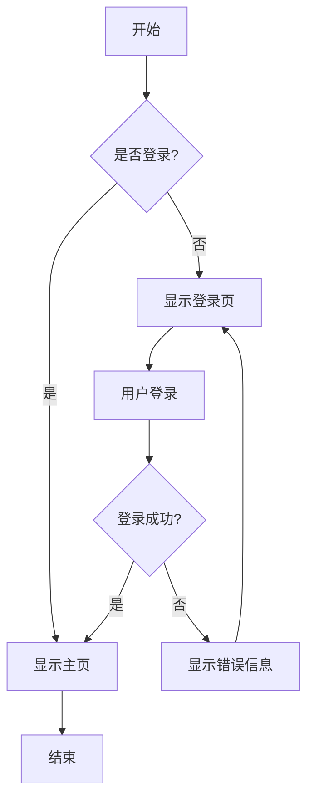
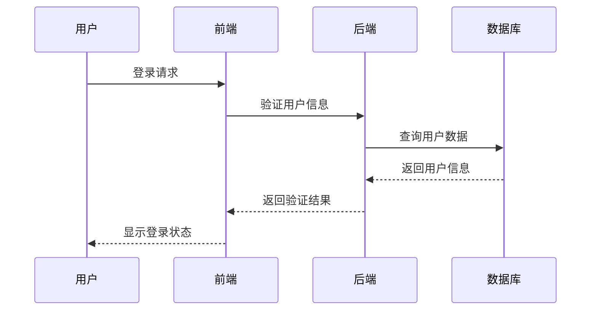
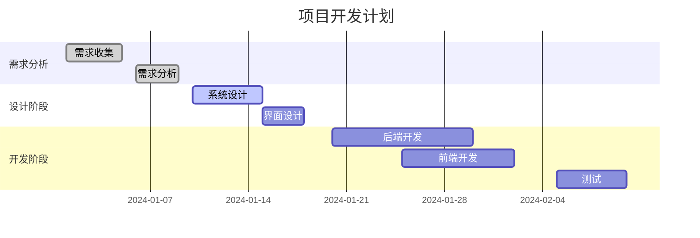

# Mermaid 可视化渲染器

一个功能强大的 Mermaid 图表渲染工具，支持将图表渲染为白色背景的图片并直接复制到剪贴板。

## 功能特性

- 🎨 **实时渲染**: 支持多种 Mermaid 图表类型
- 📋 **一键复制**: 将图表复制为白色背景图片到剪贴板
- 💾 **图片下载**: 支持下载高质量 PNG 图片
- 🚀 **快速示例**: 内置多种图表类型示例
- ⌨️ **快捷键支持**: 提高操作效率
- 📱 **响应式设计**: 支持桌面和移动设备
- 🖼️ **超高清渲染**: 支持标准(2x)、高清(4x)、超高清(8x)三种图片质量
- ⚡ **优化渲染**: 针对SVG渲染进行了专门优化，确保图片清晰度

## 支持的图表类型

- **流程图** (Flowchart)
- **时序图** (Sequence Diagram)
- **甘特图** (Gantt Chart)
- **饼图** (Pie Chart)
- **思维导图** (Mindmap)
- **类图** (Class Diagram)
- **状态图** (State Diagram)
- **用户旅程图** (User Journey)
- **Git 图** (Git Graph)

## 使用方法

### 1. 打开工具
直接在浏览器中打开 `mermaid-renderer.html` 文件。

### 2. 选择图片质量
在编辑器上方选择图片质量：
- **标准 (2x)**: 适合一般用途，文件较小
- **高清 (4x)**: 推荐设置，平衡质量和文件大小
- **超高清 (8x)**: 最高质量，适合打印或高分辨率显示

### 3. 输入代码
在左侧编辑器中输入您的 Mermaid 代码，或点击快速示例按钮加载预设示例。

### 4. 渲染图表
点击"🔄 渲染图表"按钮或使用快捷键 `Ctrl+Enter` 来渲染图表。

### 5. 复制图片
点击"📋 复制为图片"按钮或使用快捷键 `Ctrl+S` 将图表复制为白色背景图片到剪贴板。

### 6. 下载图片
点击"💾 下载图片"按钮将图片保存到本地。

## 快捷键

- `Ctrl+Enter`: 渲染图表
- `Ctrl+S`: 复制为图片

## 示例代码

### 流程图

### 时序图

### 甘特图

## 技术实现

- **Mermaid.js**: 图表渲染引擎
- **html2canvas**: SVG 转图片转换
- **Clipboard API**: 剪贴板操作
- **响应式 CSS**: 现代化界面设计

## 浏览器兼容性

- Chrome 76+
- Firefox 70+
- Safari 13.1+
- Edge 79+

## 注意事项

1. 复制功能需要 HTTPS 环境或 localhost
2. 某些浏览器可能需要用户授权剪贴板访问
3. 大型图表可能需要较长的渲染时间
4. 建议使用现代浏览器以获得最佳体验

## 故障排除

### 复制功能不工作
- 确保在 HTTPS 环境或 localhost 下运行
- 检查浏览器是否支持 Clipboard API
- 尝试手动授权剪贴板访问权限

### 图表渲染失败
- 检查 Mermaid 语法是否正确
- 确保代码格式符合 Mermaid 规范
- 查看浏览器控制台错误信息

### 图片质量问题
- 工具提供三种质量选项：标准(2x)、高清(4x)、超高清(8x)
- 超高清模式提供最佳清晰度，适合打印和高分辨率显示
- 对于复杂图表，建议使用高清或超高清模式
- SVG渲染已优化，确保文字和图形边缘清晰

## 更新日志

### v2.0.0 (最新)
- 🆕 新增图片质量选择功能（标准/高清/超高清）
- 🆕 超高清模式支持8x缩放，提供最佳清晰度
- 🆕 优化SVG渲染设置，提升图片质量
- 🆕 改进html2canvas配置，支持更好的SVG转换
- 🆕 添加图片质量状态提示
- 🔧 优化Mermaid配置，提升渲染效果

### v1.0.0
- 初始版本发布
- 支持基本的 Mermaid 图表渲染
- 实现图片复制和下载功能
- 添加多种图表类型示例
- 响应式界面设计